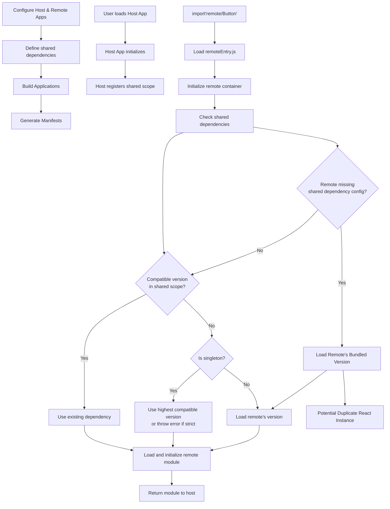

```mermaid
flowchart TD
A[Configure Host & Remote Apps] --> B[Define shared dependencies]
B --> C[Build Applications]
C --> D[Generate Manifests]

    E[User loads Host App] --> F[Host App initializes]
    F --> G[Host registers shared scope]

    H[import'remote/Button'] --> I[Load remoteEntry.js]
    I --> J[Initialize remote container]
    J --> K[Check shared dependencies]

    K --> L{Compatible version
in shared scope?}
    L -->|Yes| M[Use existing dependency]
    L -->|No| N{Is singleton?}

    N -->|Yes| O[Use highest compatible version
or throw error if strict]
    N -->|No| P[Load remote's version]

    M --> Q[Load and initialize remote module]
    O --> Q
    P --> Q

    Q --> R[Return module to host]

    %% Additional Flow for Missing Shared Config in Remote %%
    K --> S{Remote missing
shared dependency config?}
    S -->|Yes| T[Load Remote's Bundled Version]
    T --> U[Potential Duplicate React Instance]
    T --> P

    S -->|No| L
```
